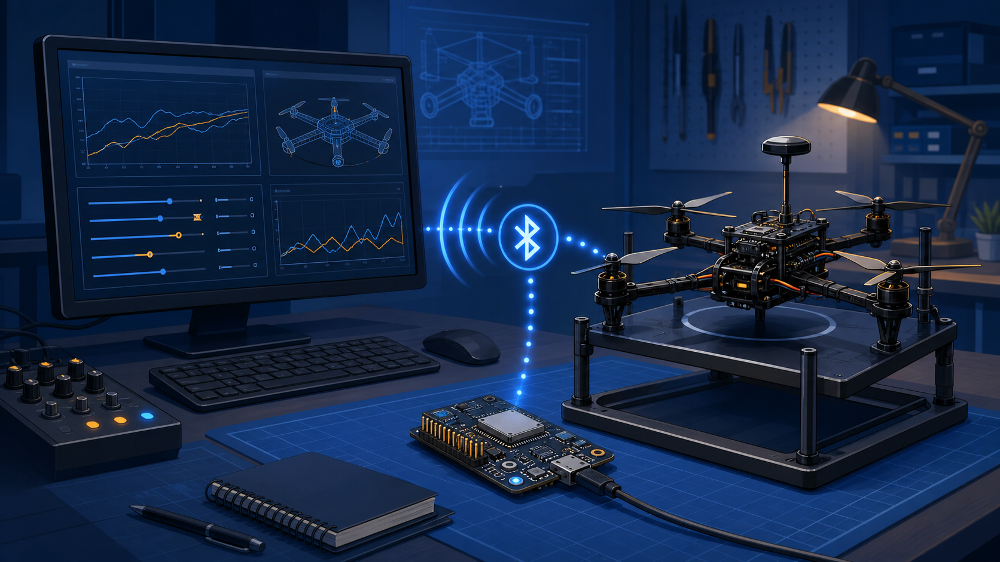
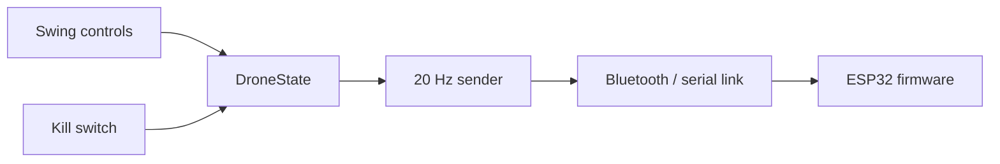

# ESP32 Drone PID Controller

Java Swing desktop controller for experimenting with an ESP32 drone link over Bluetooth. The main screen exposes PID values, desired angle, thrust controls, and a gradual kill-switch ramp-down.



_Illustration for the repository cover; it is not a screenshot of the controller._

## Data path



The controller sends five little-endian floats in order: `P`, `I`, `D`, `thrust`, and `desiredAngle`.

## Requirements

- JDK 23 and Maven 3.9+
- A paired ESP32 Bluetooth SPP device with matching firmware
- A Bluetooth stack compatible with BlueCove, or a serial-port alternative such as jSerialComm

## Build and run

```bash
mvn package
```

Run `com.tp.maven.ESP32BluetoothPIDImproved`. A Bluetooth address can be supplied as the first program argument; otherwise the UI starts with its default address for local testing.

Addresses may be supplied with or without `:`/`-` separators. Invalid addresses are rejected before the controller opens. Use `--help` to print the command format.

## Safety and limits

This is an experimental tuning tool, not a flight-safety system. Test with props removed or on a secured rig. The ESP32 firmware should independently zero thrust when packets stop arriving; a desktop application cannot guarantee safety after a dropped link. BlueCove is legacy and Bluetooth support varies by platform.
